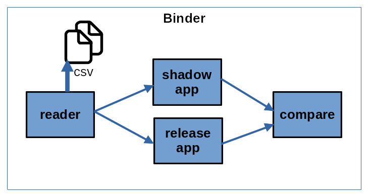

# Overview
The following picture depicts the global architecture of the project.

  

This project is use to highlight the `shadow application` use-case. In this use case, two applications (`relaase` and `shadow`) run in paralle. The  `release` application is the application currently running and the `shadow` application is a new version of the `release` application. The goal is to test the `shadow` application while the `release` application is running. Both applications are feed with same data coming from a sensor. Applications use the data to produce outputs. Outputs from `release` and `shadow` applications can be different, dépending on the algorithm they implement. Finally, a `compare` application is used to compare outputs from both applications in order to detect differences. When outputs are not identical, then the `compare` application send a signal.  

The four applications used are detailled below :
- **reader** :  
This application simulate a sensor by reading a CSV file (fic.csv) containing data along with timestamps. Each line of this file is sent using the `data_event` event at 1 Hz (one a second).   

- **release** :  
This applicaton act as the current running application. It subscribes to the `data_event`event sent by the `reader` application. Then, the `release` application forward the `data_event` event as-is, without modifications. Thus, the event sent by the `release` application is `date_event` event.

- **shadow** :  
This application acts as a new version of the `release` application. It is almost the same as the `release` application except that sometime (each 5 events), the `shadow` application modifies the data in the `data_event` received from the `reader` application before forwarding them.
*You can notice that for the `shadow` and `release` applications, two cpp files are used (apps/shadow.cpp and apps/release.cpp). This is for tutorial purpose only.*

- **compare** :  
Finally, this application subscribes to the `data_event` events sent from the `release` and `shadow` applications. When events are received, this application compares the data. If data differ, the application output a message.

# compile + launch

follow doc

https://docs.redpesk.bzh/docs/en/master/getting_started/host-configuration/docs/1-Setup-your-build-host.html

```bash
wget -O - https://raw.githubusercontent.com/redpesk-devtools/redpesk-sdk-tools/master/install-redpesk-sdk.sh | bash
```

# Build and run
## Depedencies
In order to build and run all applications in this project, you must :
1. Install the SDK : https://docs.redpesk.bzh/docs/en/master/getting_started/host-configuration/docs/1-Setup-your-build-host.html
2. Install dependencies : https://docs.redpesk.bzh/docs/en/master/getting_started/host-configuration/docs/2-getting-source-files.html  

## quick compilation + start
```
 ./start-demo.sh
```

## manual build/launch hackaton

```bash
# compile sample
mkdir -p build && cd build
cmake .. && make

# start-demo
cd ..
export BUIDDIR=$(pwd)/build
afb-binder --config=hackaton.config -vvv
```

```bash
...
INFO: running with pid 50284
INFO: API monitor added
...
NOTICE: Listening interface *:1234
NOTICE: [API compare] received released
NOTICE: [API compare] received shadow
NOTICE: [API compare] same value 1 1
NOTICE: [API compare] received released
NOTICE: [API compare] received shadow
NOTICE: [API compare] same value 2 2
NOTICE: [API compare] received released
NOTICE: [API compare] received shadow
NOTICE: [API compare] same value 3 3
NOTICE: [API compare] received released
NOTICE: [API compare] received shadow
NOTICE: [API compare] same value 4 4
NOTICE: [API compare] received released
NOTICE: [API compare] received shadow
NOTICE: [API compare] value differs (shadow=5 88) != (release=5 5)
NOTICE: [API compare] received released
NOTICE: [API compare] received shadow
NOTICE: [API compare] same value 6 6
```
